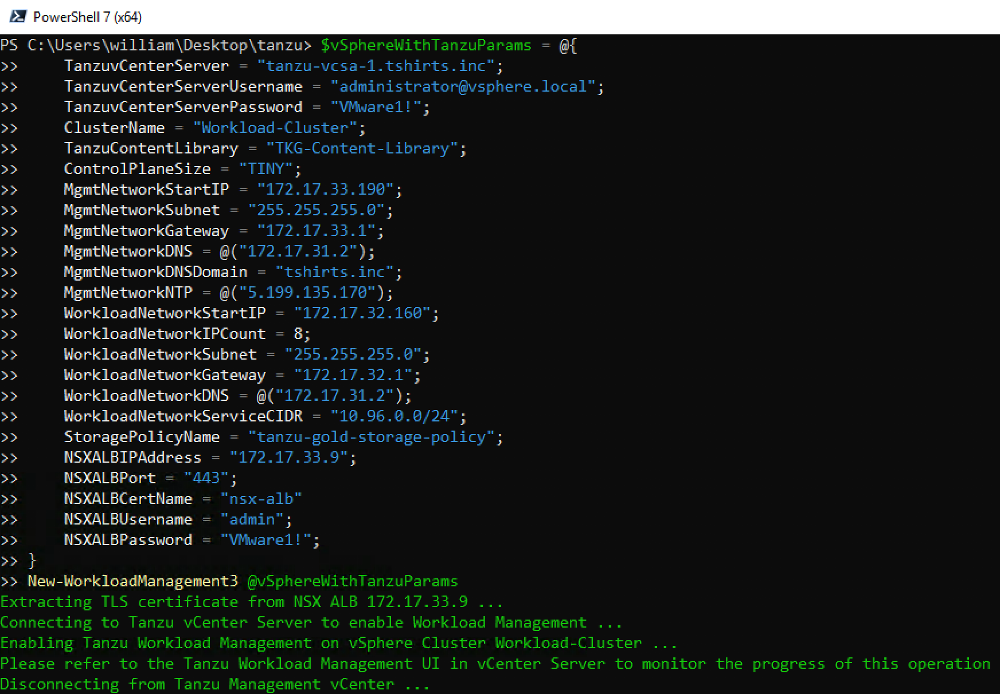
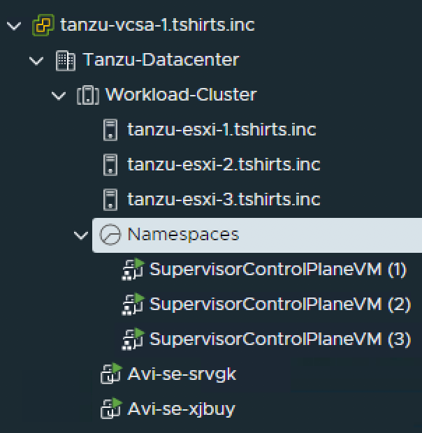

# Automated vSphere with Tanzu using NSX Advanced Load Balancer Lab Deployment

## Table of Contents

* [Description](#description)
* [Changelog](#changelog)
* [Requirements](#requirements)
* [FAQ](#faq)
* [Configuration](#configuration)
* [Logging](#logging)
* [Sample Execution](#sample-execution)
    * [Lab Deployment Script](#lab-deployment-script)
    * [Enable Workload Management](#enable-workload-management)

## Description

Similar to previous "Automated Lab Deployment Scripts" (such as [here](https://www.virtuallyghetto.com/2016/11/vghetto-automated-vsphere-lab-deployment-for-vsphere-6-0u2-vsphere-6-5.html), [here](https://www.virtuallyghetto.com/2017/10/vghetto-automated-nsx-t-2-0-lab-deployment.html), [here](https://www.virtuallyghetto.com/2018/06/vghetto-automated-pivotal-container-service-pks-lab-deployment.html), [here](https://www.virtuallyghetto.com/2020/04/automated-vsphere-7-and-vsphere-with-kubernetes-lab-deployment-script.html) and [here](https://www.virtuallyghetto.com/2020/10/automated-vsphere-with-tanzu-lab-deployment-script.html)), this script makes it very easy for anyone to deploy a vSphere 7.0 Update 2 environment setup with [vSphere with Tanzu and the new NSX Advanced Load Balancer (NSX ALB)](https://core.vmware.com/blog/vsphere-tanzu-nsx-advanced-load-balancer-essentials) in a Nested Lab environment for learning and educational purposes. All required VMware components (ESXi, vCenter Server and NSX ALB VMs) are automatically deployed and configured to allow for the enablement of vSphere with Tanzu. For more details about vSphere with Tanzu, please refer to the official VMware documentation [here](https://docs.vmware.com/en/VMware-vSphere/7.0/vmware-vsphere-with-tanzu/GUID-152BE7D2-E227-4DAA-B527-557B564D9718.html).

Below is a diagram of what is deployed as part of the solution and you simply need to have an existing vSphere environment running that is managed by vCenter Server and with enough resources (CPU, Memory and Storage) to deploy this "Nested" lab. For workload management enablement (post-deployment operation), please have a look at the [Sample Execution](#sample-execution) section below.

You are now ready to get your K8s on! 😁


## Changelog

* **04/05/2021**
  * Initial Release

## Requirements
* vCenter Server running at least vSphere 6.7 or later
    * If your physical storage is vSAN, please ensure you've applied the following setting as mentioned [here](https://www.virtuallyghetto.com/2013/11/how-to-run-nested-esxi-on-top-of-vsan.html)
* Resource Requirements
    * Compute
        * Ability to provision VMs with up to 8 vCPU
        * Ability to provision up to 108 GB of memory
    * Network
        * 1 x Standard or Distributed Portgroup (routable) to deploy all VMs (vSphere Management, NSX ALB + Supervisor Management)
           * 5 x IP Addresses for VCSA, ESXi and NSX ALB VM
           * 5 x Consecutive IP Addresses for Kubernetes Control Plane VMs
           * 8 x IP Addresses for NSX ALB Service Engine VMs
        * 1 x Standard or Distributed Portgroup (routable) for combined Load Balancer IPs + Workload Network (e.g. 172.17.32.128/26)
            * IP Range for NSX ALB VIP/Load Balancer addresses (e.g. 172.17.32.152-172.17.32.159)
            * IP Range for Workload Network (e.g. 172.17.32.160-172.17.32.179)
    * Storage
        * Ability to provision up to 1TB of storage

        **Note:** For detailed requirements, plesae refer to the official document [here](https://docs.vmware.com/en/VMware-vSphere/7.0/vmware-vsphere-with-tanzu/GUID-EE236215-DA4D-4579-8BEB-A693D1882C77.html)

* Desktop (Windows, Mac or Linux) with latest PowerShell Core and PowerCLI 12.1 Core installed. See [ instructions here](https://blogs.vmware.com/PowerCLI/2018/03/installing-powercli-10-0-0-macos.html) for more details
* vSphere 7 Update 2 & NSX ALB OVAs:
    * [vCenter Server Appliance 7.0 Update 2 Build 17694817](https://my.vmware.com/web/vmware/downloads/details?downloadGroup=VC70U2&productId=974&rPId=61844)
    * [NSX ALB 20.1.4-9087 OVA](https://my.vmware.com/web/vmware/downloads/details?downloadGroup=NSX-ALB-10&productId=1092&rPId=55618)
    * [Nested ESXi 7.0 Update 2 OVA](https://download3.vmware.com/software/vmw-tools/nested-esxi/Nested_ESXi7.0u2_Appliance_Template_v1.ova)

## FAQ

1) Can I reduce the default CPU, Memory and Storage resources?

    * You can, see this [blog post](https://www.virtuallyghetto.com/2020/04/deploying-a-minimal-vsphere-with-kubernetes-environment.html) for more details. I have not personally tested reducing CPU and Memory resources for NSX ALB, YMMV.

3) Can I just deploy vSphere (VCSA, ESXi) and vSAN without NSX ALB and vSphere with Tanzu?

    * Yes, simply search for the following variables and change their values to `0` to not deploy Tanzu components or run through the configurations

        ```
        $deployNSXAdvLB = 0
        $setupTanzuStoragePolicy = 0
        $setupTanzu = 0
        $setupNSXAdvLB = 0
        ```
6) How do I enable Workload Management after the script has completed?

    * Please see [Enable Workload Management](#enable-workload-management) section for instructions

7) How do I troubleshoot enabling or consuming vSphere with Tanzu?

    * Please refer to this [troubleshooting tips for vSphere with Kubernetes](https://www.virtuallyghetto.com/2020/05/troubleshooting-tips-for-configuring-vsphere-with-kubernetes.html) blog post

8) Is there a way to automate the enablement of Workload Management to a vSphere Cluster?

    * Yes, the [Workload Management PowerCLI Module for automating vSphere with Tanzu](https://www.virtuallyghetto.com/2020/05/workload-management-powercli-module-for-automating-vsphere-with-kubernetes.html) can be used. Please see [Enable Workload Management](#enable-workload-management) section for instructions

9) Can I deploy vSphere with Tanzu using NSX-T instead of NSX ALB?
    * Yes, you will need to use the previous version of the [Automated vSphere with Kubernetes deployment script](https://www.virtuallyghetto.com/2020/04/automated-vsphere-7-and-vsphere-with-kubernetes-lab-deployment-script.html) and substituting the vSphere 7.0 Update 2 images

## Configuration

Before you can run the script, you will need to edit the script and update a number of variables to match your deployment environment. Details on each section is described below including actual values used in my home lab environment.

This section describes the credentials to your physical vCenter Server in which the vSphere with Tanzu lab environment will be deployed to:
```console
$VIServer = "FILL-ME-IN"
$VIUsername = "FILL-ME-IN"
$VIPassword = "FILL-ME-IN"
```

This section describes the required TKG Content Library needed for deploying TKG Clusters.

```console
$TKGContentLibraryName = "TKG-Content-Library"
$TKGContentLibraryURL = "https://wp-content.vmware.com/v2/latest/lib.json"
```

This section describes the location of the files required for deployment.

```console
$NestedESXiApplianceOVA = "C:\Users\william\Desktop\tanzu\Nested_ESXi7.0u2_Appliance_Template_v1.ova"
$VCSAInstallerPath = "C:\Users\william\Desktop\tanzu\VMware-VCSA-all-7.0.2-17694817"
$NSXAdvLBOVA = "C:\Users\william\Desktop\tanzu\controller-20.1.4-9087.ova"
```
**Note:** The path to the VCSA Installer must be the extracted contents of the ISO

This section describes the Tanzu Kubernetes Grid vSphere Content Library to subscribed from. This should be left alone and just ensure your environment has outbound connectivity to this endpoint

```console
$TKGContentLibraryName = "TKG-Content-Library"
$TKGContentLibraryURL = "https://wp-content.vmware.com/v2/latest/lib.json"
```

This section defines the number of Nested ESXi VMs to deploy along with their associated IP Address(s). The names are merely the display name of the VMs when deployed. At a minimum, you should deploy at least three hosts, but you can always add additional hosts and the script will automatically take care of provisioning them correctly.
```console
$NestedESXiHostnameToIPs = @{
    "tanzu-esxi-1" = "172.17.33.4"
    "tanzu-esxi-2" = "172.17.33.5"
    "tanzu-esxi-3" = "172.17.33.6"
}
```

This section describes the resources allocated to each of the Nested ESXi VM(s). Depending on your usage, you may need to increase the resources. For Memory and Disk configuration, the unit is in GB.
```console
$NestedESXivCPU = "4"
$NestedESXivMEM = "24" #GB
$NestedESXiCachingvDisk = "8" #GB
$NestedESXiCapacityvDisk = "200" #GB
```

This section describes the VCSA deployment configuration such as the VCSA deployment size, Networking & SSO configurations. If you have ever used the VCSA CLI Installer, these options should look familiar.
```console
$VCSADeploymentSize = "tiny"
$VCSADisplayName = "tanzu-vcsa-1"
$VCSAIPAddress = "172.17.33.3"
$VCSAHostname = "tanzu-vcsa-1.tshirts.inc" #Change to IP if you don't have valid DNS
$VCSAPrefix = "24"
$VCSASSODomainName = "vsphere.local"
$VCSASSOPassword = "VMware1!"
$VCSARootPassword = "VMware1!"
$VCSASSHEnable = "true"
```

This section describes the NSX ALB VM configurations

```console
$NSXAdvLBDisplayName = "tanzu-nsx-alb"
$NSXAdvLByManagementIPAddress = "172.17.33.9"
$NSXAdvLBHostname = "tanzu-nsx-alb.tshirts.inc"
$NSXAdvLBAdminPassword = "VMware1!"
$NSXAdvLBvCPU = "8" #GB
$NSXAdvLBvMEM = "24" #GB
$NSXAdvLBPassphrase = "VMware"
$NSXAdvLBIPAMName = "Tanzu-Defaulf-IPAM"
```

This section describes the Service Engine Network Configuration

```console
$NSXAdvLBManagementNetwork = "172.17.33.0"
$NSXAdvLBManagementNetworkPrefix = "24"
$NSXAdvLBManagementNetworkStartRange = "172.17.33.180"
$NSXAdvLBManagementNetworkEndRange = "172.17.33.187"
````

This section describes the combined VIP/Frontend and Workload Network Configuration

```console
$NSXAdvLBCombinedVIPWorkloadNetwork = "Nested-Tanzu-Workload"
$NSXAdvLBWorkloadNetwork = "172.17.32.128"
$NSXAdvLBWorkloadNetworkPrefix = "26"
$NSXAdvLBWorkloadNetworkStartRange = "172.17.32.152"
$NSXAdvLBWorkloadNetworkEndRange = "172.17.32.159"
```

This section describes the self-sign TLS certificate to generate for NSX ALB

```console
$NSXAdvLBSSLCertName = "nsx-alb"
$NSXAdvLBSSLCertExpiry = "365" # Days
$NSXAdvLBSSLCertEmail = "admini@primp-industries.local"
$NSXAdvLBSSLCertOrganizationUnit = "R&D"
$NSXAdvLBSSLCertOrganization = "primp-industries"
$NSXAdvLBSSLCertLocation = "Palo Alto"
$NSXAdvLBSSLCertState = "CA"
$NSXAdvLBSSLCertCountry = "US"
```

This section describes the location as well as the generic networking settings applied to Nested ESXi VCSA & NSX VMs

```console
$VMDatacenter = "San Jose"
$VMCluster = "Compute Cluster"
$VMNetwork = "Nested-Tanzu-Mgmt"
$VMDatastore = "comp-vsanDatastore"
$VMNetmask = "255.255.255.0"
$VMGateway = "172.17.33.1"
$VMDNS = "172.17.31.2"
$VMNTP = "45.87.78.35"
$VMPassword = "VMware1!"
$VMDomain = "tshirts.inc"
$VMSyslog = "172.17.33.3"
$VMFolder = "Tanzu"
# Applicable to Nested ESXi only
$VMSSH = "true"
$VMVMFS = "false"
```

This section describes the configuration of the new vCenter Server from the deployed VCSA. **Default values are sufficient.**

```console
$NewVCDatacenterName = "Tanzu-Datacenter"
$NewVCVSANClusterName = "Workload-Cluster"
$NewVCVDSName = "Tanzu-VDS"
$NewVCMgmtPortgroupName = "DVPG-Supervisor-Management-Network"
$NewVCWorkloadPortgroupName = "DVPG-Workload-Network"
```

This section describes the Tanzu Configurations. **Default values are sufficient.**

```console
$StoragePolicyTagCategory = "tanzu-demo-tag-category"
$StoragePolicyTagName = "tanzu-demo-storage"
$DevOpsUsername = "devops"
$DevOpsPassword = "VMware1!"
```

Once you have saved your changes, you can now run the PowerCLI script as you normally would.

## Logging

There is additional verbose logging that outputs as a log file in your current working directory **tanzu-nsx-adv-lb-lab-deployment.log**

## Sample Execution

In this example below, I will be using a two /24 VLANs (172.17.33.0/24 and 172.17.32.0/24). The first network will be used to provision all VMs and place them under typical vSphere Management network configuration and 5 IPs will be allocated from this range for the Supervisor Control Plane and 8 IPs for the NSX ALB Service Engine. The second network will combine both IP ranges for the NSX ALB VIP/Frontend function as well as the IP ranges for Workloads. See the table below for the explicit network mappings and it is expected that you have a setup similar to what has been outlined.

| Hostname                  | IP Address                  | Function                                               |
|---------------------------|-----------------------------|--------------------------------------------------------|
| tanzu-vcsa-1.tshirts.inc  | 172.17.33.3                 | vCenter Server                                         |
| tanzu-esxi-1.tshirts.inc  | 172.17.31.4                 | ESXi-1                                                 |
| tanzu-esxi-2.tshirts.inc  | 172.17.31.5                 | ESXi-2                                                 |
| tanzu-esxi-3.tshirts.inc  | 172.17.31.6                 | ESXi-3                                                 |
| tanzu-nsx-alb.tshirts.inc | 172.17.31.9                 | NSX ALB                                                |
| N/A                       | 172.17.33.180-172.17.31.187 | Service Engine (8 IPs from Mgmt Network)               |
| N/A                       | 172.17.33.190-172.17.31.195 | Supervisor Control Plane (5 IPs from Mgmt Network)     |
| N/A                       | 172.17.32.152-172.17.32.159 | NSX ALB VIP/Load Balancer IP Range                     |
| N/A                       | 172.17.36.160-172.17.36.179 | Workload IP Range                                      |

### Lab Deployment Script

Here is a screenshot of running the script if all basic pre-reqs have been met and the confirmation message before starting the deployment:


Here is an example output of a complete deployment:


**Note:** Deployment time will vary based on underlying physical infrastructure resources. In my lab, this took ~29min to complete.

Once completed, you will end up with your deployed vSphere with Kubernetes Lab which is placed into a vApp


### Enable Workload Management

To consume the vSphere with Tanzu capability in vSphere 7.0 Update 2, you must enable workload management on a specific vSphere Cluster, which is not part of this automation script.

You have two options:

1) You can enable workload management by using the vSphere UI. For more details, please refer to the official VMware documentation [here](https://docs.vmware.com/en/VMware-vSphere/7.0/vmware-vsphere-with-kubernetes/GUID-21ABC792-0A23-40EF-8D37-0367B483585E.html).

Here is an example output of what the deployment configuration should look like for my network setup:


2) You can use my community [PowerCLI module (VMware.WorkloadManagement)](https://www.powershellgallery.com/packages/VMware.WorkloadManagement/1.0.9) to automate the enablement of workload management:

Here is an example using the `New-WorkloadManagement3` function and the same configuration as shown in the UI above to enable workload management:

```console
Import-Module VMware.WorkloadManagement

$vSphereWithTanzuParams = @{
    TanzuvCenterServer = "tanzu-vcsa-1.tshirts.inc";
    TanzuvCenterServerUsername = "administrator@vsphere.local";
    TanzuvCenterServerPassword = "VMware1!";
    ClusterName = "Workload-Cluster";
    TanzuContentLibrary = "TKG-Content-Library";
    ControlPlaneSize = "TINY";
    MgmtNetworkStartIP = "172.17.33.190";
    MgmtNetworkSubnet = "255.255.255.0";
    MgmtNetworkGateway = "172.17.33.1";
    MgmtNetworkDNS = @("172.17.31.2");
    MgmtNetworkDNSDomain = "tshirts.inc";
    MgmtNetworkNTP = @("5.199.135.170");
    WorkloadNetworkStartIP = "172.17.32.160";
    WorkloadNetworkIPCount = 8;
    WorkloadNetworkSubnet = "255.255.255.0";
    WorkloadNetworkGateway = "172.17.32.1";
    WorkloadNetworkDNS = @("172.17.31.2");
    WorkloadNetworkServiceCIDR = "10.96.0.0/24";
    StoragePolicyName = "tanzu-gold-storage-policy";
    NSXALBIPAddress = "172.17.33.9";
    NSXALBPort = "443";
    NSXALBCertName = "nsx-alb"
    NSXALBUsername = "admin";
    NSXALBPassword = "VMware1!";
}
New-WorkloadManagement3 @vSphereWithTanzuParams
```

Here is an example output of running the above snippet:



Upon a successful enablement of workload management, you should have two NSX ALB Service Engine VMs deployed:

